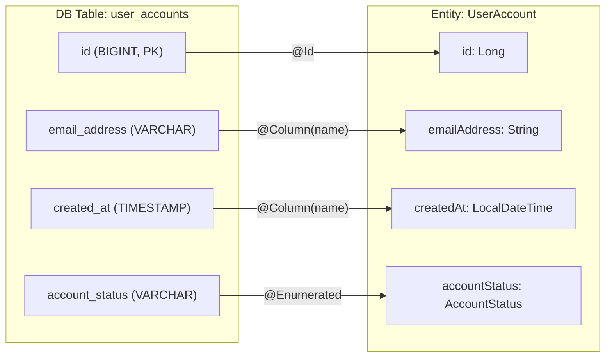
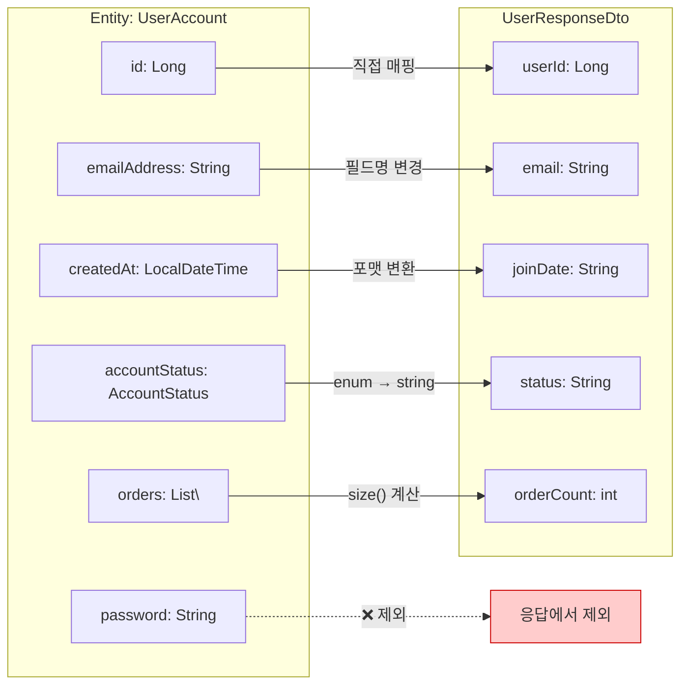
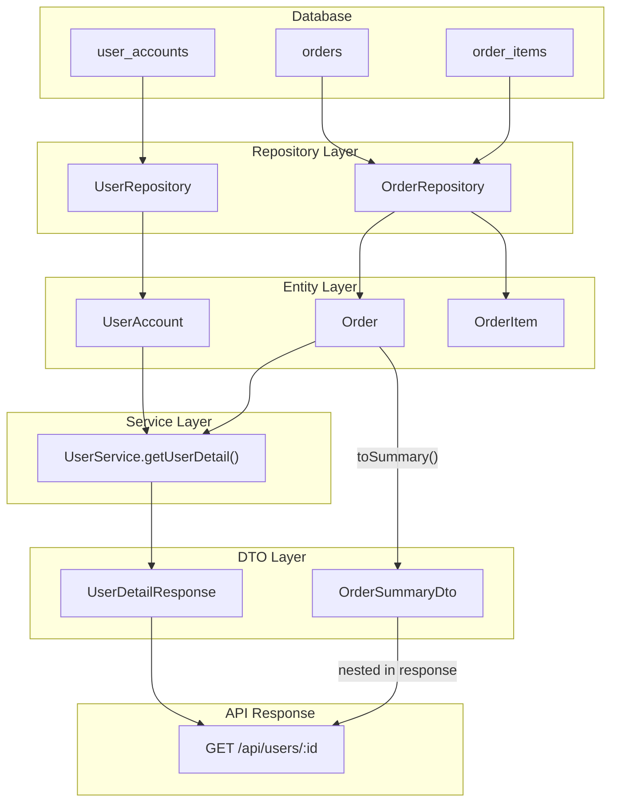
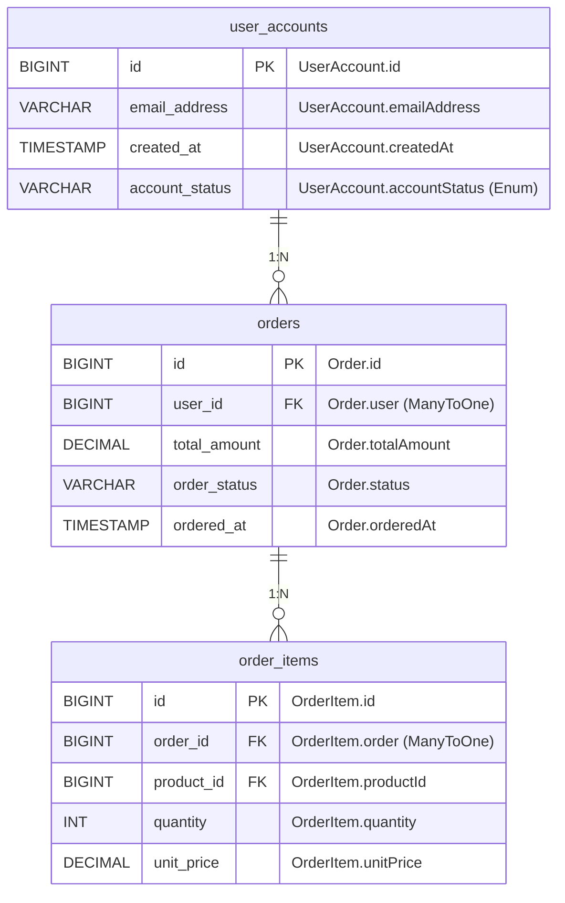
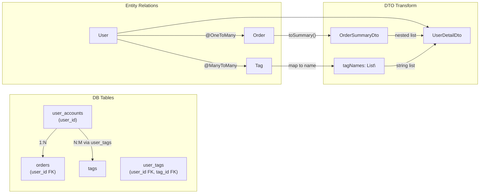

# Mermaid Data Flow Diagram Templates

데이터 흐름 시각화를 위한 Mermaid 다이어그램 템플릿 모음.
MDX 문법 호환성을 위해 `@.claude/core/MDX.md` 규칙을 반드시 준수할 것.

---

## DB Column → Entity Field 매핑 다이어그램

DB 테이블의 컬럼과 코드 엔티티 필드 간 이름 차이를 시각화한다.



---

## Entity → DTO 변환 흐름

Entity에서 DTO로 데이터가 변환되는 과정과 필드 매핑을 시각화한다.



---

## 전체 데이터 흐름 (DB → Entity → DTO → Response)

하나의 API 요청에서 데이터가 DB부터 최종 응답까지 변환되는 전체 과정.



---

## ER 다이어그램 + 컬럼 매핑 주석

테이블 간 관계와 함께 코드에서의 필드명을 주석으로 병기한다.



---

## 필드 매핑 테이블 (다이어그램 보조)

다이어그램과 함께 상세한 필드 매핑을 테이블로 정리한다.

```markdown
### user_accounts → UserAccount → UserResponseDto

| DB Column | Type | Entity Field | Entity Type | DTO Field | DTO Type | 변환 방식 |
|-----------|------|-------------|-------------|-----------|----------|----------|
| id | BIGINT | id | Long | userId | Long | 직접 매핑 |
| email_address | VARCHAR | emailAddress | String | email | String | 필드명 변경 |
| created_at | TIMESTAMP | createdAt | LocalDateTime | joinDate | String | 포맷 변환 (yyyy-MM-dd) |
| account_status | VARCHAR | accountStatus | AccountStatus | status | String | enum.name() |
| password_hash | VARCHAR | password | String | - | - | 응답 제외 |
```

---

## 관계 매핑 시각화

N:1, 1:N, N:M 관계에서 데이터가 어떻게 변환되는지 보여준다.



---

## 다이어그램 작성 규칙

- 노드 레이블에 특수문자 포함 시 반드시 따옴표로 감싸기: `["Promise<Data>"]`
- 줄바꿈: `<br/>`, 이탤릭: `<i>`, 볼드: `<b>`
- 서브그래프 이름에 공백 포함 시: `subgraph "서브그래프 이름"`
- 제외/에러 노드는 붉은색 스타일: `style node fill:#ffcccc,stroke:#cc0000`
- 현재 분석 대상은 초록색 스타일: `style node fill:#d4edda,stroke:#28a745,stroke-width:3px`
- 다이어그램당 노드 수 20개 이내로 유지
- 테스트: https://mermaid.live
