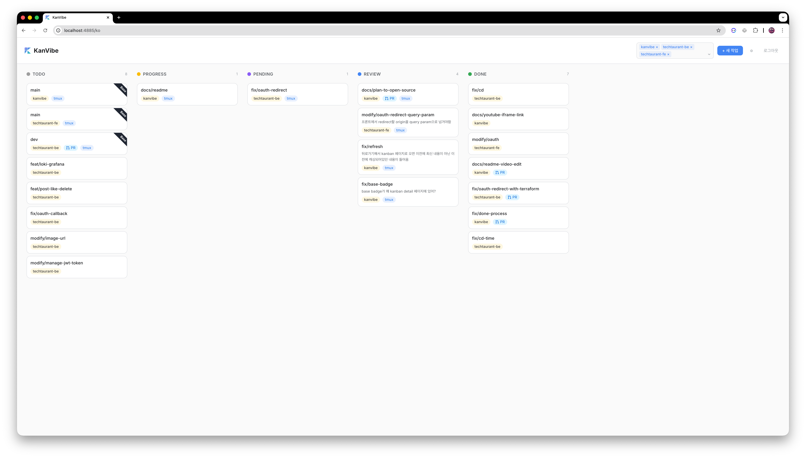
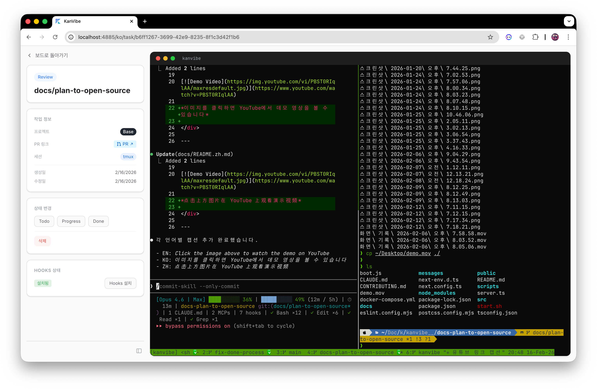

<div align="center">

# KanVibe

**AI Agent Task Management Kanban Board**

A web-based terminal Kanban board for managing AI coding agent (Claude Code, Gemini CLI, etc.) tasks in real-time.
Monitor tmux/zellij sessions directly in your browser while tracking task progress on a drag & drop Kanban board.
Automatically track task status via [AI Agent Hooks](#ai-agent-hooks---automatic-status-tracking) — no manual updates needed.

[](https://buymeacoffee.com/rookedsysc)

> Buying me a coffee is nice, but honestly? A contribution would make my day even more. :)

[KO](./docs/README.ko.md) | [ZH](./docs/README.zh.md)

</div>

<div align="center">

[](https://www.youtube.com/watch?v=8JTrvd3T_Z0)

**▶ [Watch Demo on YouTube](https://www.youtube.com/watch?v=8JTrvd3T_Z0)**

<table>
  <tr>
    <td width="50%"></td>
    <td width="50%"></td>
  </tr>
</table>

</div>

---

## Prerequisites

| Dependency | Version | Install |
|------------|---------|---------|
| [Node.js](https://nodejs.org/) | >= 22 | [Download](https://nodejs.org/en/download/) |
| [tmux](https://github.com/tmux/tmux) or [zellij](https://github.com/zellij-org/zellij) | latest | `brew install tmux` / `apt install tmux` |
| [Docker](https://www.docker.com/) | latest | [Download](https://docs.docker.com/get-docker/) |

> Docker is used to run the PostgreSQL database via Docker Compose.

---

## Quick Start

### 1. Configure Environment

```bash
cp .env.example .env
```

| Variable | Description | Default |
|----------|-------------|---------|
| `PORT` | Web server port | `4885` |
| `DB_PORT` | PostgreSQL port | `4886` |
| `KANVIBE_USER` | Login username | `admin` |
| `KANVIBE_PASSWORD` | Login password | `changeme` (change this!) |

### 2. Run

```bash
bash start.sh
```

This single command handles everything: dependency installation, PostgreSQL startup, database migration, build, and server launch.

Open `http://localhost:4885` in your browser.

---

## Usage Flow

### 1. Register a Project

Search for your local git repository using the **fzf-style folder search** in project settings. KanVibe scans the directory and automatically detects existing worktree branches.

### 2. Create Tasks

Add a TODO task from the Kanban board. When creating a task with a branch name, KanVibe automatically:
- Creates a **git worktree** for the branch
- Spawns a **tmux window** or **zellij tab** for the session
- Links the terminal session to the task

### 3. Work with the Kanban Board

Tasks are managed through 5 statuses: **TODO** → **PROGRESS** → **PENDING** → **REVIEW** → **DONE**

Change statuses via drag & drop, or let [AI Agent Hooks](#ai-agent-hooks---automatic-status-tracking) transition them automatically. When a task moves to **DONE**, its branch, worktree, and terminal session are **automatically deleted**.

### 4. Select Pane Layouts

Each task's terminal page supports multiple pane layouts:

| Layout | Description |
|--------|-------------|
| **Single** | One full-screen pane |
| **Horizontal 2** | Two panes side by side |
| **Vertical 2** | Two panes stacked |
| **Left + Right TB** | Left pane + right top/bottom split |
| **Left TB + Right** | Left top/bottom split + right pane |
| **Quad** | Four equal panes |

Each pane can run a custom command (e.g., `vim`, `htop`, `lazygit`, test runner, etc.). Configure layouts globally or per-project from the settings dialog.

---

## Features

### Kanban Board
- 5-status task management (TODO / PROGRESS / PENDING / REVIEW / DONE)
- Custom task ordering with drag & drop
- Multi-project filtering
- Done column pagination
- Real-time WebSocket updates

### Git Worktree Integration
- Automatic git worktree creation when a branch-based task is created
- Worktree scanning: existing branches are auto-registered as TODO tasks
- Automatic cleanup (branch + worktree + session) when task moves to DONE

### Terminal Sessions (tmux / zellij)
- **tmux** and **zellij** are both supported as terminal multiplexers
- Browser-based terminal via xterm.js + WebSocket
- SSH remote terminal support (reads `~/.ssh/config`)
- Nerd Font rendering support

### AI Agent Hooks - Automatic Status Tracking
KanVibe integrates with **Claude Code Hooks** and **Gemini CLI Hooks** to automatically track task status. Tasks are managed through 5 statuses:

| Status | Description |
|--------|-------------|
| **TODO** | Initial state when a task is created |
| **PROGRESS** | AI is actively working on the task |
| **PENDING** | AI asked a follow-up question; waiting for user response (Claude Code only) |
| **REVIEW** | AI has finished; awaiting review |
| **DONE** | Task complete — branch, worktree, and terminal session are **automatically deleted** |

#### Claude Code
```
User sends prompt          → PROGRESS
AI asks question (AskUser) → PENDING
User answers               → PROGRESS
AI finishes response       → REVIEW
```

#### Gemini CLI
```
BeforeAgent (user prompt)  → PROGRESS
AfterAgent (agent done)    → REVIEW
```

> Gemini CLI does not have an equivalent to Claude Code's `AskUserQuestion`, so the PENDING state is not available.

Both hooks are **auto-installed** when you register a project through KanVibe's directory scan. You can also install them individually from the project settings or task detail page.

| Agent | Hook Directory | Config File |
|-------|---------------|-------------|
| Claude Code | `.claude/hooks/` | `.claude/settings.json` |
| Gemini CLI | `.gemini/hooks/` | `.gemini/settings.json` |

#### Hook API Endpoints

| Endpoint | Method | Description |
|----------|--------|-------------|
| `/api/hooks/start` | POST | Create a new task |
| `/api/hooks/status` | POST | Update task status by `branchName` + `projectName` |

### Pane Layout Editor
- 6 layout presets (Single, Horizontal 2, Vertical 2, Left+Right TB, Left TB+Right, Quad)
- Per-pane custom command configuration
- Global and per-project layout settings

### Internationalization (i18n)
- Supported languages: Korean (ko), English (en), Chinese (zh)
- Powered by next-intl

---

## Tech Stack

| Category | Technology |
|----------|------------|
| Frontend/Backend | Next.js 16 (App Router) + React 19 + TypeScript |
| Database | PostgreSQL 16 + TypeORM |
| Styling | Tailwind CSS v4 |
| Terminal | xterm.js + WebSocket + node-pty |
| SSH | ssh2 (Node.js) |
| Drag & Drop | @hello-pangea/dnd |
| i18n | next-intl |
| Container | Docker Compose |

---

## License

This project is licensed under the **AGPL-3.0**. You are free to use, modify, and extend it for open-source purposes. Commercial SaaS distribution is not permitted under this license. See [LICENSE](./LICENSE) for details.

---

## Contributing

See [docs/CONTRIBUTING.md](./docs/CONTRIBUTING.md) for guidelines.

---

## Inspired By

- [workmux](https://github.com/raine/workmux) — tmux workspace manager
- [vibe-kanban](https://github.com/BloopAI/vibe-kanban) — AI-powered Kanban board
