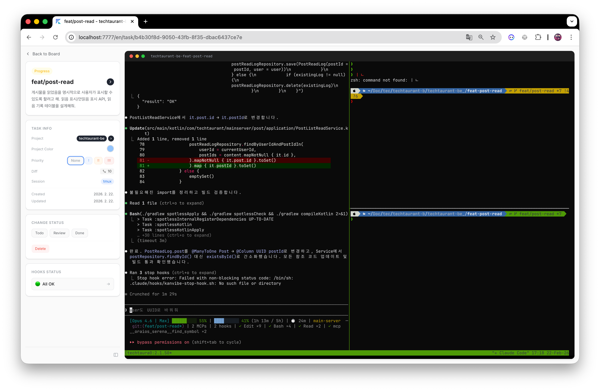

<div align="center">

# KanVibe

**AI 에이전트 작업 관리 칸반 보드**

AI 코딩 에이전트(Claude Code, Gemini CLI, Codex CLI 등)의 작업을 실시간으로 관리하는 웹 기반 터미널 칸반 보드.
브라우저에서 tmux/zellij 세션을 직접 모니터링하며, 드래그 앤 드롭 칸반 보드로 작업 진행 상황을 추적합니다.
[AI 에이전트 Hooks](#ai-에이전트-hooks---자동-상태-추적) 기반 자동 상태 트래킹을 지원하여 수동 업데이트가 필요 없습니다.

[](https://buymeacoffee.com/rookedsysc)

> 커피도 좋지만, 솔직히 Contribution 해주시면 더 좋습니다. :)

[EN](../README.md) | [ZH](./README.zh.md)

</div>

<div align="center">

[](https://www.youtube.com/watch?v=8JTrvd3T_Z0)

**▶ [YouTube에서 데모 보기](https://www.youtube.com/watch?v=8JTrvd3T_Z0)**

<table>
  <tr>
    <td width="50%"></td>
    <td width="50%"></td>
  </tr>
</table>

</div>

---

## 사전 요구사항

`kanvibe` CLI 스크립트가 누락된 의존성을 자동으로 확인하고 설치합니다. 수동 설치도 가능합니다:

| 의존성 | 버전 | 필수 | 설치 |
|--------|------|------|------|
| [Node.js](https://nodejs.org/) | >= 22 | Yes | `brew install node` |
| [pnpm](https://pnpm.io/) | 최신 | Yes | `corepack enable && corepack prepare pnpm@latest --activate` |
| [Docker](https://www.docker.com/) | 최신 | Yes | `brew install --cask docker` |
| [git](https://git-scm.com/) | 최신 | Yes | `brew install git` |
| [tmux](https://github.com/tmux/tmux) | 최신 | Yes | `brew install tmux` |
| [gh](https://cli.github.com/) | 최신 | Yes | `brew install gh` (`gh auth login` 필요) |
| [zellij](https://github.com/zellij-org/zellij) | 최신 | No | `brew install zellij` |

> Docker는 Docker Compose를 통해 PostgreSQL 데이터베이스를 실행하는 데 사용됩니다.

---

## 빠른 시작

### 1. 환경변수 설정

```bash
cp .env.example .env
```

| 변수 | 설명 | 기본값 |
|------|------|--------|
| `PORT` | 웹 서버 포트 | `4885` |
| `DB_PORT` | PostgreSQL 포트 | `4886` |
| `KANVIBE_USER` | 로그인 사용자명 | `admin` |
| `KANVIBE_PASSWORD` | 로그인 비밀번호 | `changeme` (변경 필수!) |

### 2. 실행

```bash
bash kanvibe.sh start          # 인터랙티브 모드 선택 (포그라운드/백그라운드)
bash kanvibe.sh start --fg     # 포그라운드 (터미널에 직접 출력, Ctrl+C로 종료)
bash kanvibe.sh start --bg     # 백그라운드 (터미널 닫아도 서버 유지)
```

의존성 체크(i18n 설치 프롬프트 포함), 패키지 설치, PostgreSQL 시작, 마이그레이션, 빌드, 서버 실행까지 모두 처리됩니다.

```bash
bash kanvibe.sh stop
```

KanVibe 서버와 PostgreSQL 컨테이너를 종료합니다.

브라우저에서 `http://localhost:4885` 접속.

---

## 사용 흐름

### 1. 프로젝트 등록

프로젝트 설정에서 **fzf 스타일 폴더 검색**으로 로컬 git 저장소를 검색하고 등록합니다. KanVibe가 디렉토리를 스캔하여 기존 worktree 브랜치를 자동 감지합니다.

### 2. 태스크 생성

칸반 보드에서 TODO 태스크를 추가합니다. 브랜치명으로 태스크를 생성하면 KanVibe가 자동으로:
- 해당 브랜치의 **git worktree** 생성
- **tmux window** 또는 **zellij tab**으로 터미널 세션 생성
- 터미널 세션을 태스크에 연결

### 3. 칸반 보드에서 작업

5단계 상태로 태스크를 관리합니다: **TODO** → **PROGRESS** → **PENDING** → **REVIEW** → **DONE**

드래그 앤 드롭으로 상태를 변경하거나, [AI 에이전트 Hooks](#ai-에이전트-hooks---자동-상태-추적)를 통해 자동으로 전환됩니다. 태스크가 **DONE**으로 이동하면 브랜치, worktree, 터미널 세션이 **자동으로 삭제**됩니다.

### 4. Pane 레이아웃 선택

각 태스크의 터미널 페이지에서 다양한 pane 레이아웃을 지원합니다:

| 레이아웃 | 설명 |
|----------|------|
| **Single** | 전체 화면 단일 pane |
| **Horizontal 2** | 좌우 2분할 |
| **Vertical 2** | 상하 2분할 |
| **Left + Right TB** | 왼쪽 + 오른쪽 상하 분할 |
| **Left TB + Right** | 왼쪽 상하 분할 + 오른쪽 |
| **Quad** | 4등분 |

각 pane에 커스텀 명령어를 설정할 수 있습니다 (예: `vim`, `htop`, `lazygit`, 테스트 러너 등). 레이아웃은 전역 또는 프로젝트별로 설정 가능합니다.

---

## 기능

### 칸반 보드
- 5단계 상태 관리 (TODO / PROGRESS / PENDING / REVIEW / DONE)
- 사용자 정의 태스크 정렬
- 다중 프로젝트 필터링
- Done 컬럼 페이지네이션
- WebSocket 기반 실시간 업데이트

### Git Worktree 연동
- 브랜치 기반 태스크 생성 시 git worktree 자동 생성
- Worktree 스캔: 기존 브랜치를 TODO 태스크로 자동 등록
- DONE 상태 전환 시 브랜치 + worktree + 세션 자동 정리

### 터미널 세션 (tmux / zellij)
- **tmux**와 **zellij** 모두 터미널 멀티플렉서로 지원
- xterm.js + WebSocket 기반 브라우저 터미널
- SSH 원격 터미널 지원 (`~/.ssh/config` 읽기)
- Nerd Font 렌더링 지원

### AI 에이전트 Hooks - 자동 상태 추적
KanVibe는 **Claude Code Hooks**, **Gemini CLI Hooks**, **Codex CLI**, **OpenCode**와 연동하여 태스크 상태를 자동 추적합니다. 태스크는 5가지 상태로 관리됩니다:

| 상태 | 설명 |
|------|------|
| **TODO** | 생성된 태스크의 초기 상태 |
| **PROGRESS** | AI가 작업 중인 상태 |
| **PENDING** | AI가 사용자에게 재질문하여 답변 대기 중인 상태 (Claude Code만 지원) |
| **REVIEW** | AI 작업이 완료되어 리뷰 대기 중인 상태 |
| **DONE** | 작업 완료 — 브랜치, worktree, 터미널 세션이 **자동 삭제**됩니다 |

#### Claude Code
```
사용자가 프롬프트 전송     → PROGRESS
AI가 재질문 (AskUser)     → PENDING
사용자가 답변             → PROGRESS
AI 응답 완료              → REVIEW
```

#### Gemini CLI
```
BeforeAgent (사용자 프롬프트) → PROGRESS
AfterAgent (에이전트 완료)   → REVIEW
```

> Gemini CLI에는 Claude Code의 `AskUserQuestion`에 대응하는 이벤트가 없어 PENDING 상태는 지원되지 않습니다.

#### Codex CLI (부분 지원)
```
agent-turn-complete (에이전트 완료) → REVIEW
```

> Codex CLI는 현재 `notify` 설정의 `agent-turn-complete` 이벤트만 지원합니다. PROGRESS, PENDING 전환은 아직 불가합니다. OpenAI가 [hooks 시스템을 설계 중](https://github.com/openai/codex/discussions/2150)이며, 출시되면 전체 지원을 추가할 예정입니다.

#### OpenCode
```
사용자 메시지 전송 (message.updated, role=user) → PROGRESS
AI 질문 대기 (question.asked)                   → PENDING
사용자 질문 답변 (question.replied)              → PROGRESS
세션 대기 (session.idle)                        → REVIEW
```

OpenCode는 셸 스크립트 hooks 대신 자체 [플러그인 시스템](https://opencode.ai/docs/plugins/)을 사용합니다. KanVibe는 `.opencode/plugins/kanvibe-plugin.ts`에 TypeScript 플러그인을 생성하여 `@opencode-ai/plugin` SDK를 통해 OpenCode의 네이티브 이벤트 hooks(`message.updated`, `question.asked`, `question.replied`, `session.idle`)를 구독합니다. 외부 셸 명령을 실행하지 않고 프로세스 내에서 상태 업데이트를 처리합니다.

모든 에이전트 Hook은 KanVibe 디렉토리 스캔으로 프로젝트를 등록하거나 worktree와 함께 태스크를 생성하면 **자동 설치**됩니다. 태스크 상세 페이지에서 개별 설치도 가능합니다.

| 에이전트 | Hook 디렉토리 | 설정 파일 |
|---------|-------------|----------|
| Claude Code | `.claude/hooks/` | `.claude/settings.json` |
| Gemini CLI | `.gemini/hooks/` | `.gemini/settings.json` |
| Codex CLI | `.codex/hooks/` | `.codex/config.toml` |
| OpenCode | `.opencode/plugins/` | 플러그인 자동 탐색 |

#### 브라우저 알림

AI 에이전트 Hooks를 통한 태스크 상태 변경이 **브라우저 알림**으로 전달됩니다. 프로젝트명, 브랜치명, 변경된 상태를 표시하며, **알림을 클릭하면 해당 작업 상세 페이지로 이동**합니다.

- **실시간 알림** — 태스크 상태 변경 시 즉시 알림 수신
- **백그라운드 모드** — KanVibe가 포커스되지 않아도 알림 수신
- **스마트 네비게이션** — 알림 클릭 → 작업 상세 페이지 이동 (현재 언어 유지)
- **커스터마이징** — 프로젝트별 알림 활성화/비활성화 및 상태별 필터링 지원

설정: 최초 접속 시 브라우저 알림 권한을 허용해 주세요. **프로젝트 설정** → **알림**에서 상태별 필터를 조정할 수 있습니다.

#### Hook API 엔드포인트

| 엔드포인트 | 메서드 | 설명 |
|-----------|--------|------|
| `/api/hooks/start` | POST | 새 태스크 생성 |
| `/api/hooks/status` | POST | `branchName` + `projectName`으로 태스크 상태 변경 |

### GitHub 스타일 Diff 뷰

브라우저에서 GitHub 스타일의 diff 뷰어로 코드 변경사항을 바로 확인할 수 있습니다. 태스크 상세 페이지의 **Diff** 뱃지를 클릭하면 base 브랜치 대비 변경된 모든 파일을 확인할 수 있습니다.

<table>
  <tr>
    <td width="30%"></td>
    <td width="70%"></td>
  </tr>
</table>

- 변경 파일 수가 표시되는 파일 트리 사이드바
- Monaco Editor 기반 인라인 diff 뷰어
- 브라우저에서 바로 수정 가능한 에딧 모드
- 체크박스로 확인한 파일 추적

### Pane 레이아웃 에디터
- 6가지 레이아웃 프리셋 (Single, Horizontal 2, Vertical 2, Left+Right TB, Left TB+Right, Quad)
- pane별 커스텀 명령어 설정
- 전역 및 프로젝트별 레이아웃 설정

### 국제화 (i18n)
- 지원 언어: 한국어(ko), 영어(en), 중국어(zh)
- next-intl 기반

---

## 기술 스택

| 카테고리 | 기술 |
|----------|------|
| Frontend/Backend | Next.js 16 (App Router) + React 19 + TypeScript |
| Database | PostgreSQL 16 + TypeORM |
| Styling | Tailwind CSS v4 |
| Terminal | xterm.js + WebSocket + node-pty |
| SSH | ssh2 (Node.js) |
| Drag & Drop | @hello-pangea/dnd |
| i18n | next-intl |
| Container | Docker Compose |

---

## 라이센스

이 프로젝트는 **AGPL-3.0** 라이센스를 따릅니다. 오픈소스 목적으로 자유롭게 사용, 수정, 확장할 수 있습니다. 상업적 SaaS 배포는 이 라이센스에서 허용되지 않습니다. 자세한 내용은 [LICENSE](../LICENSE)를 참조하세요.

---

## 기여하기

[CONTRIBUTING.ko.md](./CONTRIBUTING.ko.md)를 참조하세요.

---

## Inspired By

- [workmux](https://github.com/raine/workmux) — tmux workspace manager
- [vibe-kanban](https://github.com/BloopAI/vibe-kanban) — AI-powered Kanban board
