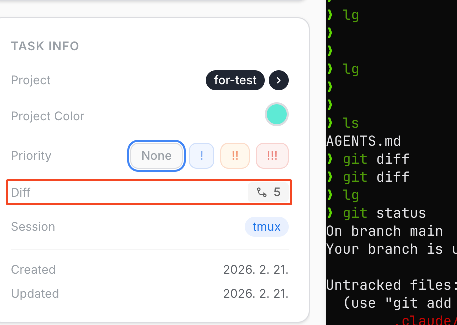
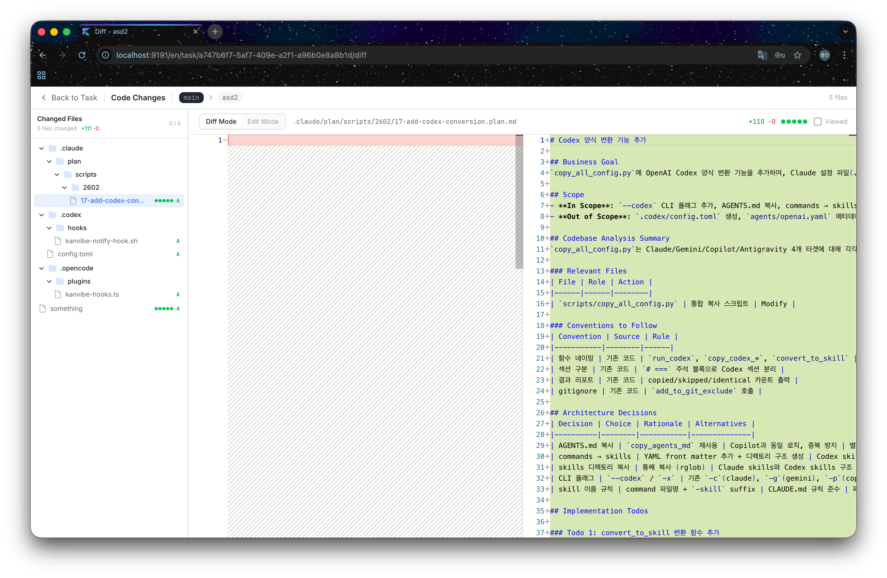

<div align="center">

# KanVibe

**AI 代理任务管理看板**

用于实时管理 AI 编程代理（Claude Code、Gemini CLI、Codex CLI 等）任务的基于 Web 的终端看板。
在浏览器中直接监控 tmux/zellij 会话，同时通过拖放看板追踪任务进度。
通过 [AI 代理 Hooks](#ai-代理-hooks---自动状态追踪) 自动追踪任务状态，无需手动更新。

[](https://buymeacoffee.com/rookedsysc)

> 请我喝杯咖啡也不错，但说实话，贡献代码会让我更开心。:)

[EN](../README.md) | [KO](./README.ko.md)

</div>

<div align="center">

[](https://www.youtube.com/watch?v=8JTrvd3T_Z0)

**▶ [在 YouTube 上观看演示](https://www.youtube.com/watch?v=8JTrvd3T_Z0)**

<table>
  <tr>
    <td width="50%"></td>
    <td width="50%"></td>
  </tr>
</table>

</div>

---

## 前置要求

`kanvibe` CLI 脚本会自动检查并安装缺失的依赖项。也可以手动安装：

| 依赖 | 版本 | 必需 | 安装 |
|------|------|------|------|
| [Node.js](https://nodejs.org/) | >= 22 | Yes | `brew install node` |
| [pnpm](https://pnpm.io/) | 最新 | Yes | `corepack enable && corepack prepare pnpm@latest --activate` |
| [Docker](https://www.docker.com/) | 最新 | Yes | `brew install --cask docker` |
| [git](https://git-scm.com/) | 最新 | Yes | `brew install git` |
| [tmux](https://github.com/tmux/tmux) | 最新 | Yes | `brew install tmux` |
| [gh](https://cli.github.com/) | 最新 | Yes | `brew install gh`（需要 `gh auth login`） |
| [zellij](https://github.com/zellij-org/zellij) | 最新 | No | `brew install zellij` |

> Docker 通过 Docker Compose 运行 PostgreSQL 数据库。

---

## 快速开始

### 1. 配置环境变量

```bash
cp .env.example .env
```

| 变量 | 说明 | 默认值 |
|------|------|--------|
| `PORT` | Web 服务器端口 | `4885` |
| `DB_PORT` | PostgreSQL 端口 | `4886` |
| `KANVIBE_USER` | 登录用户名 | `admin` |
| `KANVIBE_PASSWORD` | 登录密码 | `changeme`（请修改！） |

### 2. 运行

```bash
bash kanvibe.sh start          # 交互式模式选择（前台/后台）
bash kanvibe.sh start --fg     # 前台运行（输出到终端，Ctrl+C 停止）
bash kanvibe.sh start --bg     # 后台运行（关闭终端后服务器继续运行）
```

此命令会检查依赖项（带有 i18n 安装提示）、安装包、启动 PostgreSQL、运行迁移、构建并启动服务器。

```bash
bash kanvibe.sh stop
```

停止 KanVibe 服务器和 PostgreSQL 容器。

在浏览器中打开 `http://localhost:4885`。

---

## 使用流程

### 1. 注册项目

在项目设置中使用 **fzf 风格的文件夹搜索** 查找并注册本地 git 仓库。KanVibe 会扫描目录并自动检测现有的 worktree 分支。

### 2. 创建任务

在看板中添加 TODO 任务。使用分支名创建任务时，KanVibe 会自动：
- 为该分支创建 **git worktree**
- 生成 **tmux window** 或 **zellij tab** 终端会话
- 将终端会话链接到任务

### 3. 在看板中工作

任务通过 5 个状态进行管理：**TODO** → **PROGRESS** → **PENDING** → **REVIEW** → **DONE**

通过拖放更改状态，或通过 [AI 代理 Hooks](#ai-代理-hooks---自动状态追踪) 自动转换。当任务移至 **DONE** 时，分支、worktree 和终端会话会**自动删除**。

### 4. 选择面板布局

每个任务的终端页面支持多种面板布局：

| 布局 | 说明 |
|------|------|
| **Single** | 全屏单面板 |
| **Horizontal 2** | 左右两分 |
| **Vertical 2** | 上下两分 |
| **Left + Right TB** | 左侧 + 右侧上下分割 |
| **Left TB + Right** | 左侧上下分割 + 右侧 |
| **Quad** | 四等分 |

每个面板可以配置自定义命令（如 `vim`、`htop`、`lazygit`、测试运行器等）。布局可以全局设置或按项目设置。

---

## 功能

### 看板
- 5 状态任务管理（TODO / PROGRESS / PENDING / REVIEW / DONE）
- 自定义任务排序
- 多项目筛选
- Done 列分页
- 基于 WebSocket 的实时更新

### Git Worktree 集成
- 创建基于分支的任务时自动创建 git worktree
- Worktree 扫描：自动将现有分支注册为 TODO 任务
- 任务移至 DONE 时自动清理分支 + worktree + 会话

### 终端会话（tmux / zellij）
- 同时支持 **tmux** 和 **zellij** 作为终端复用器
- 基于 xterm.js + WebSocket 的浏览器终端
- SSH 远程终端支持（读取 `~/.ssh/config`）
- Nerd Font 渲染支持

### AI 代理 Hooks - 自动状态追踪
KanVibe 与 **Claude Code Hooks**、**Gemini CLI Hooks**、**Codex CLI** 和 **OpenCode** 集成，自动追踪任务状态。任务通过 5 个状态进行管理：

| 状态 | 说明 |
|------|------|
| **TODO** | 任务创建时的初始状态 |
| **PROGRESS** | AI 正在处理任务 |
| **PENDING** | AI 向用户提出追问，等待用户回复（仅 Claude Code 支持） |
| **REVIEW** | AI 已完成工作，等待审查 |
| **DONE** | 任务完成 — 分支、worktree、终端会话会**自动删除** |

#### Claude Code
```
用户发送提示词              → PROGRESS
AI 追问 (AskUser)          → PENDING
用户回答                    → PROGRESS
AI 完成响应                 → REVIEW
```

#### Gemini CLI
```
BeforeAgent（用户提示词）    → PROGRESS
AfterAgent（代理完成）       → REVIEW
```

> Gemini CLI 没有与 Claude Code 的 `AskUserQuestion` 对应的事件，因此不支持 PENDING 状态。

#### Codex CLI（部分支持）
```
agent-turn-complete（代理完成） → REVIEW
```

> Codex CLI 目前仅支持 `notify` 配置的 `agent-turn-complete` 事件。PROGRESS 和 PENDING 转换尚不可用。OpenAI 正在[设计 hooks 系统](https://github.com/openai/codex/discussions/2150)，发布后将添加完整支持。

#### OpenCode
```
用户发送消息 (chat.message)  → PROGRESS
会话空闲 (session.idle)      → REVIEW
```

OpenCode 使用自己的[插件系统](https://opencode.ai/docs/plugins/)，而非 shell 脚本 hooks。KanVibe 在 `.opencode/plugins/kanvibe-plugin.ts` 生成 TypeScript 插件，通过 `@opencode-ai/plugin` SDK 订阅 OpenCode 的原生事件 hooks（`chat.message` 和 `session.idle`）。状态更新在进程内处理，无需启动外部 shell 命令。

通过 KanVibe 目录扫描注册项目或创建带有 worktree 的任务时，所有代理 Hook 会**自动安装**。也可以在任务详情页面中单独安装。

| 代理 | Hook 目录 | 配置文件 |
|------|----------|---------|
| Claude Code | `.claude/hooks/` | `.claude/settings.json` |
| Gemini CLI | `.gemini/hooks/` | `.gemini/settings.json` |
| Codex CLI | `.codex/hooks/` | `.codex/config.toml` |
| OpenCode | `.opencode/plugins/` | 插件自动发现 |

#### 浏览器通知

AI 代理 Hooks 触发的任务状态变更会发送**浏览器通知**，显示项目名称、分支名称和新状态。**点击通知可直接跳转到对应任务详情页面**。

- **实时通知** — 任务状态变更时立即收到通知
- **后台模式** — KanVibe 不在焦点时也能收到通知
- **智能导航** — 点击通知 → 任务详情页面（保持当前语言）
- **可自定义** — 按项目启用/禁用，并可按状态筛选（PROGRESS、PENDING、REVIEW、DONE）

设置：首次访问时请允许浏览器通知权限。在**项目设置** → **通知**中配置筛选条件。

#### Hook API 端点

| 端点 | 方法 | 说明 |
|------|------|------|
| `/api/hooks/start` | POST | 创建新任务 |
| `/api/hooks/status` | POST | 通过 `branchName` + `projectName` 更新任务状态 |

### GitHub 风格 Diff 视图

在浏览器中使用 GitHub 风格的 diff 查看器直接审查代码变更。点击任务详情页面上的 **Diff** 徽章，即可查看与 base 分支相比的所有修改文件。

<table>
  <tr>
    <td width="30%"></td>
    <td width="70%"></td>
  </tr>
</table>

- 显示变更文件数量的文件树侧边栏
- 基于 Monaco Editor 的内联 diff 查看器
- 可在浏览器中直接修改的编辑模式
- 复选框追踪已查看的文件

### 面板布局编辑器
- 6 种布局预设（Single、Horizontal 2、Vertical 2、Left+Right TB、Left TB+Right、Quad）
- 每个面板自定义命令配置
- 全局和按项目布局设置

### 国际化（i18n）
- 支持语言：韩语（ko）、英语（en）、中文（zh）
- 基于 next-intl

---

## 技术栈

| 类别 | 技术 |
|------|------|
| 前端/后端 | Next.js 16 (App Router) + React 19 + TypeScript |
| 数据库 | PostgreSQL 16 + TypeORM |
| 样式 | Tailwind CSS v4 |
| 终端 | xterm.js + WebSocket + node-pty |
| SSH | ssh2 (Node.js) |
| 拖放 | @hello-pangea/dnd |
| 国际化 | next-intl |
| 容器 | Docker Compose |

---

## 许可证

本项目使用 **AGPL-3.0** 许可证。您可以自由地用于开源目的进行使用、修改和扩展。此许可证不允许商业 SaaS 分发。详情请参阅 [LICENSE](../LICENSE)。

---

## 贡献

请参阅 [CONTRIBUTING.zh.md](./CONTRIBUTING.zh.md)。

---

## Inspired By

- [workmux](https://github.com/raine/workmux) — tmux workspace manager
- [vibe-kanban](https://github.com/BloopAI/vibe-kanban) — AI-powered Kanban board
