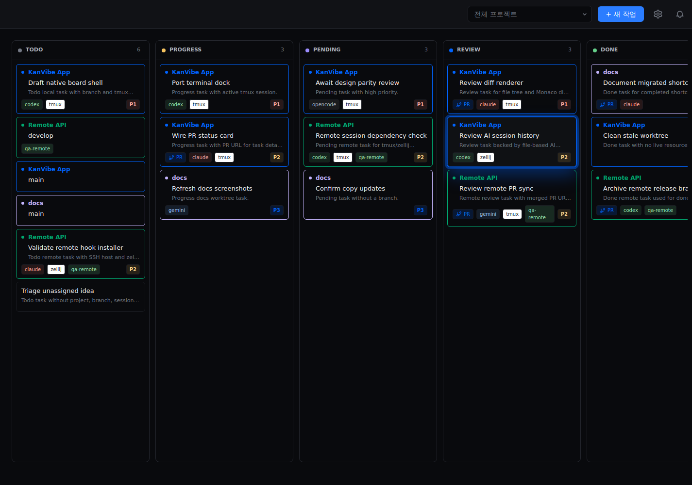
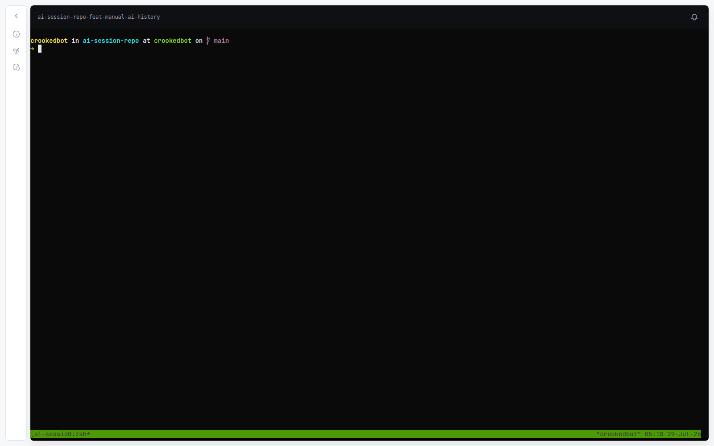
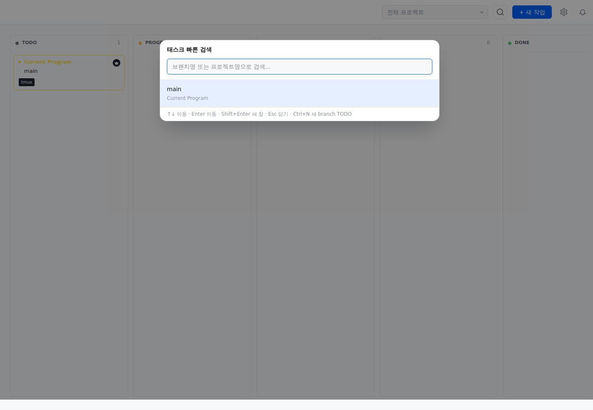
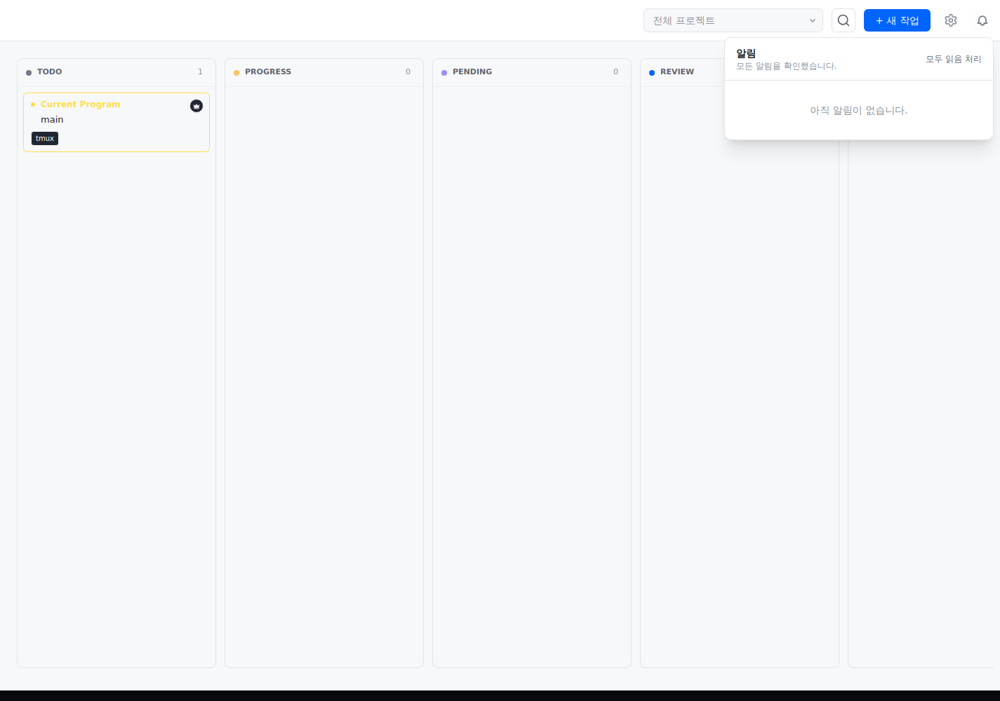
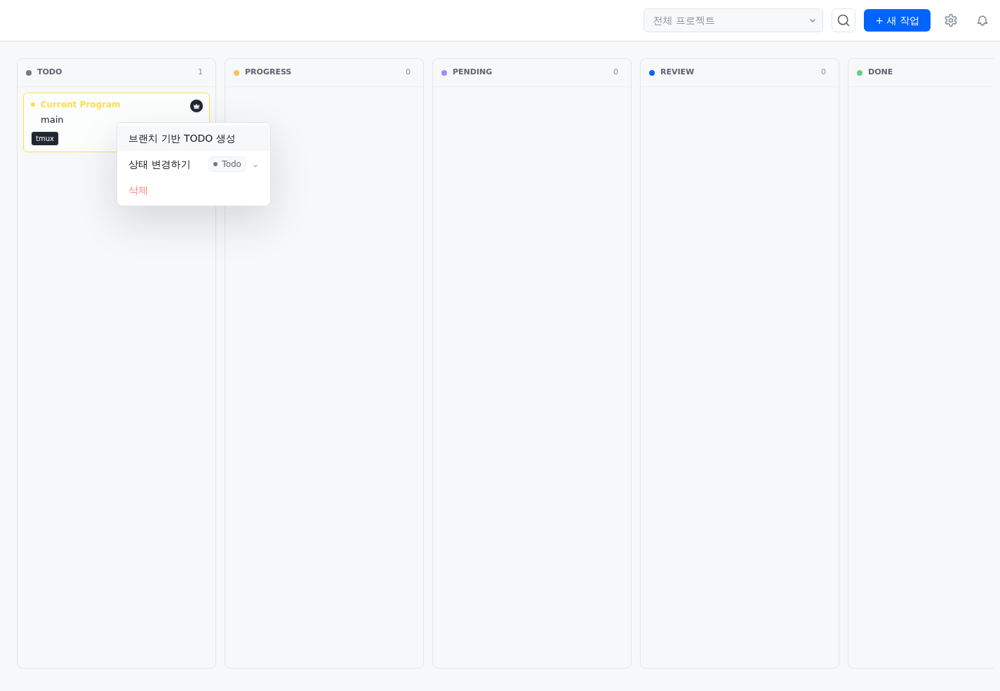

<div align="center">

# KanVibe

**面向 AI 编程代理的键盘优先 Kanban 工作区**

KanVibe 让 AI 编程工作不再散落在一堆终端标签中。你可以在实时 Kanban 看板上跟踪基于分支的任务，在浏览器或桌面应用中打开每个任务的 tmux/zellij 会话，并让 Claude Code、Gemini CLI、Codex CLI 和 OpenCode hooks 自动推动任务在工作流中流转。

使用快捷键处理项目筛选、任务搜索、通知、任务详情面板和常用任务操作，同时不丢失终端焦点。

[](https://buymeacoffee.com/rookedsysc)

> 请我喝杯咖啡也不错，但说实话，贡献代码会让我更开心。:)

[EN](../README.md) | [KO](./README.ko.md)

</div>

<div align="center">

<table>
  <tr>
    <td width="50%">
      
      <br>
      <strong>主 Kanban 看板</strong>
    </td>
    <td width="50%">
      
      <br>
      <strong>任务详情工作区</strong>
    </td>
  </tr>
</table>

<a href="https://www.youtube.com/watch?v=8JTrvd3T_Z0">
  
</a>

<strong><a href="https://www.youtube.com/watch?v=8JTrvd3T_Z0">在 YouTube 上观看演示</a></strong>

</div>

---

## 主要工作流

### 1. 快速任务搜索

从任何位置打开任务搜索，按项目或分支名筛选，并无需先回到看板即可直接进入任务工作区。



### 2. 任务详情快捷键

在任务详情页面使用编号 dock 快捷键，在按键进入嵌入式终端之前打开任务元数据、hook 状态、AI 聊天和 PR 操作。


### 3. 项目筛选

将看板缩小到你关心的活动项目，并通过键盘导航在仓库之间快速切换。


### 4. 通知

打开通知面板，查看 AI 代理状态变化、后台同步结果和任务事件，然后跳转到相关任务。



### 5. 快速任务操作

直接从高亮的搜索结果创建后续分支 TODO，保留下一项工作所需的项目和分支上下文。



### 6. Vim 风格看板控制

在**设置 → 键盘**中启用 Vim 风格看板控制后，可以用 `h/j/k/l` 在任务卡片间移动，用 `/` 查找可见任务文本，用 `n` 打开新任务弹窗，用 `:move progress` 移动状态，并用 `dd` 删除当前聚焦任务。

<video src="./images/readme/kanvibe-vim-controls.mp4" poster="./images/readme/kanvibe-vim-controls.png" controls muted playsinline width="100%"></video>

[打开 Vim 控制演示视频](./images/readme/kanvibe-vim-controls.mp4)

---

## 前置要求

| 依赖 | 版本 | 必需 | 安装 |
|------|------|------|------|
| [git](https://git-scm.com/) | 最新 | Yes | `brew install git` |
| [tmux](https://github.com/tmux/tmux) | 最新 | Yes | `brew install tmux` |
| [gh](https://cli.github.com/) | 最新 | Yes | `brew install gh`（需要 `gh auth login`） |
| [zellij](https://github.com/zellij-org/zellij) | 最新 | No | `brew install zellij` |

---

## 快速开始

### 使用 Homebrew 安装

在 KanVibe 被官方 Homebrew Cask 仓库收录之前，请从 KanVibe Homebrew tap 安装：

```bash
brew install --cask rookedsysc/kanvibe/kanvibe
open -a KanVibe
```

官方 Homebrew Cask 收录后，安装命令将变为：

```bash
brew install --cask kanvibe
```

### 更新或移除

```bash
brew update
brew upgrade --cask kanvibe
```

```bash
brew uninstall --cask kanvibe
brew untap rookedsysc/kanvibe
```

---

## 使用流程

### 1. 注册项目

在项目设置中使用 **fzf 风格的文件夹搜索**查找本地 git 仓库。KanVibe 会扫描目录并自动检测现有的 worktree 分支。

如果要停止管理某个项目，请在项目设置中删除它。此操作只会从嵌入式 SQLite 数据库中移除该项目及其 KanVibe 任务；磁盘上的 git 分支、worktree 和文件都会保留。

### 2. 创建任务

在 Kanban 看板中添加 TODO 任务。使用分支名创建任务时，KanVibe 会自动：
- 为该分支创建 **git worktree**
- 为会话生成 **tmux window** 或 **zellij tab**
- 将终端会话链接到任务

### 3. 在看板中工作

任务通过 5 个状态进行管理：**TODO** → **PROGRESS** → **PENDING** → **REVIEW** → **DONE**

通过拖放更改状态，或让 [AI 代理 Hooks](#ai-代理-hooks---自动状态追踪) 自动转换。当任务移至 **DONE** 时，分支、worktree 和终端会话会**自动删除**。

### 4. 选择面板布局

每个任务的终端页面支持多种面板布局：

| 布局 | 说明 |
|------|------|
| **Single** | 全屏单面板 |
| **Horizontal 2** | 左右两分 |
| **Vertical 2** | 上下两分 |
| **Left + Right TB** | 左侧面板 + 右侧上下分割 |
| **Left TB + Right** | 左侧上下分割 + 右侧面板 |
| **Quad** | 四等分 |

每个面板可以运行自定义命令（如 `vim`、`htop`、`lazygit`、测试运行器等）。布局可在设置对话框中全局配置，也可按项目配置。

---

## 功能

### 实时 Kanban 看板
- 5 状态任务管理（TODO / PROGRESS / PENDING / REVIEW / DONE）
- 带项目颜色、优先级标记、PR 徽章和会话标签的拖放任务排序
- 支持键盘搜索可见项目和任务文本的多项目筛选
- 面向长期项目的 Done 列分页
- 跨浏览器和桌面窗口的实时 WebSocket 更新

### 基于分支的任务工作区
- 创建会自动准备 git worktree 和终端会话的分支 TODO
- 扫描现有 worktree 分支并注册为 TODO 任务
- 将每个任务打开到专用终端工作区，并在侧边 dock 中使用任务元数据、hook 控制、聊天和 PR 操作
- 将任务移至 DONE 时自动清理其分支、worktree 和终端会话
- 在设置中删除项目时，不会触碰现有 git 分支、worktree 或磁盘文件

### 终端会话（tmux / zellij）
- 同时支持 **tmux** 和 **zellij** 作为终端复用器
- 通过 xterm.js 和 WebSocket 进行基于浏览器的终端流式传输
- 读取 `~/.ssh/config` 的 SSH 远程终端支持
- 非交互式远程 SSH 命令会复用 `~/.kanvibe` 下的应用专用 ControlMaster socket 池，并将每个 host 的并发数限制为可用 CPU 核心数的 4 倍
- 远程终端 attach 会通过 SSH 直接执行 tmux/zellij；仅在本地 `DISPLAY`、远程 `X11Forwarding` 和 `xauth` 可用时请求 trusted X11 forwarding（`ssh -Y`）
- Nerd Font 渲染支持

### 键盘优先控制
- 从任何位置按分支名或项目名打开快速任务搜索
- 不离开看板即可筛选项目、检查通知并触发任务操作
- 在按键进入终端之前，使用编号详情快捷键切换任务信息、状态/hooks、AI 聊天、PR 和其他 dock 面板
- 使用配置的快捷键直接从快速任务搜索创建分支 TODO

### 键盘快捷键

| 快捷键 | 范围 | 操作 |
|--------|------|------|
| `Cmd/Ctrl+F` 或启用 Vim 风格控制时的 `/` | 看板 | 在当前可见的项目/任务文本中打开页面查找；按 `Enter` 查找下一个，按 `Shift+Enter` 查找上一个 |
| `h / j / k / l` 或 `← / ↓ / ↑ / →` | 看板任务卡片 | 在可见任务卡片间向左/下/上/右移动焦点；没有任务聚焦时进入第一个可见任务 |
| `n` | 看板 | 立即打开新任务弹窗 |
| `:move todo\|progress\|pending\|review\|done` | 已聚焦的看板任务卡片 | 无需拖放，将当前聚焦任务移动到目标状态；在命令输入框按 `Tab` 可补全唯一的状态前缀 |
| `dd` | 已聚焦的看板任务卡片 | 确认后删除当前聚焦任务 |
| `Cmd/Ctrl+Shift+O` | 全局 | 按分支名或项目名打开快速任务搜索（默认值，可配置） |
| `Cmd/Ctrl+Shift+P` | 看板 | 打开项目筛选下拉框 |
| `Cmd/Ctrl+Shift+I` | 看板 | 打开通知下拉框 |
| `Cmd+[` / `Cmd+]` (macOS), `Alt+[` / `Alt+]` (Linux) | 全局 | 在应用历史中后退/前进；没有上一页时后退到看板首页 |
| `Cmd+1/2/3` (macOS), `Alt+1/2/3` (Linux) | 任务详情 | 激活编号详情 dock 项：信息、状态/hooks 和 AI 聊天。这些快捷键会先于终端输入被拦截 |
| `Cmd+4` (macOS), `Alt+4` (Linux) | 任务详情 | 任务有 PR 时在浏览器中打开该 PR；否则该快捷键属于当前可见的第四个 dock 项 |
| `Cmd/Ctrl+N` | 快速任务搜索 | 基于当前高亮任务创建新的分支 TODO |
| `↑ / ↓ / Enter / Shift+Enter / Esc` | 快速任务搜索 | 移动选择、打开任务、在新窗口打开任务、关闭对话框 |
| `↑ / ↓ / Enter / Esc` | 项目筛选下拉框 | 移动选择、切换项目筛选、关闭下拉框 |
| `↑ / ↓ / Enter / Esc` | 通知下拉框 | 移动选择、打开通知目标、关闭下拉框 |

任务详情 dock 编号会排除返回看板按钮，并遵循可见 dock 项顺序。如果任务有 PR URL，PR 会占用第 4 个位置，后续 dock 项会顺延到 5+；如果没有 PR，下一个 dock 项会使用第 4 个位置。

Vim 风格看板控制（`h/j/k/l`、`/`、`n`、`dd`、`:move ...`）可在**设置 → 键盘**中启用或关闭。即使禁用 Vim 风格控制，方向键任务导航和 `Cmd/Ctrl+F` 页面查找仍然可用。

### AI 代理 Hooks - 自动状态追踪
KanVibe 与 **Claude Code Hooks**、**Gemini CLI Hooks**、**Codex CLI** 和 **OpenCode** 集成，自动追踪任务状态。任务通过 5 个状态进行管理：

| 状态 | 说明 |
|------|------|
| **TODO** | 任务创建时的初始状态 |
| **PROGRESS** | AI 正在主动处理任务 |
| **PENDING** | AI 提出后续问题，等待用户回复（仅 Claude Code 支持） |
| **REVIEW** | AI 已完成工作，等待审查 |
| **DONE** | 任务完成 — 分支、worktree 和终端会话会**自动删除** |

#### Claude Code
```
用户发送提示词              → PROGRESS
AI 追问 (AskUser)          → PENDING
用户回答                    → PROGRESS
AI 完成响应                 → REVIEW
```

#### Gemini CLI
```
BeforeAgent（用户提示词）    → PROGRESS
AfterAgent（代理完成）       → REVIEW
```

> Gemini CLI 没有与 Claude Code 的 `AskUserQuestion` 对应的事件，因此不支持 PENDING 状态。

#### Codex CLI
```
UserPromptSubmit              → PROGRESS
PermissionRequest（仅 Bash）  → PENDING
PreToolUse（仅 Bash）         → PROGRESS
Stop                          → REVIEW
```

KanVibe 现在使用 Codex 当前的 lifecycle hooks 方案：`.codex/hooks.json` 加上 `.codex/config.toml` 中的 `[features].hooks = true`：

- https://developers.openai.com/codex/hooks
- https://developers.openai.com/codex/config-reference

Codex 只会在受信任的项目/worktree 路径中加载 project-local `.codex/` hooks。如果任务运行在生成的 worktree 中，需要先在 Codex 中信任该 worktree，local hook 文件才会触发。

> 当前 Codex 的 `PermissionRequest` 和 `PreToolUse` matcher 仍然限定在 Bash 场景，因此这里的 `PENDING` 表示等待审批，而不是所有类型的对话追问。

#### OpenCode
```
用户发送消息 (message.updated, role=user) → PROGRESS
AI 提问等待 (question.asked)              → PENDING
用户回答问题 (question.replied)           → PROGRESS
会话空闲 (session.idle)                   → REVIEW
```

OpenCode 使用自己的[插件系统](https://opencode.ai/docs/plugins/)，而非 shell 脚本 hooks。KanVibe 在 `.opencode/plugins/kanvibe-plugin.ts` 生成 TypeScript 插件，通过 `@opencode-ai/plugin` SDK 订阅 OpenCode 的原生事件 hooks（`message.updated`、`question.asked`、`question.replied` 和 `session.idle`）。状态更新在进程内处理，无需启动外部 shell 命令。

通过 KanVibe 目录扫描注册项目或创建带有 worktree 的任务时，所有代理 Hook 会**自动安装**。也可以在任务详情页面中单独安装。

| 代理 | Hook 目录 | 配置文件 |
|------|----------|---------|
| Claude Code | `.claude/hooks/` | `.claude/settings.json` |
| Gemini CLI | `.gemini/hooks/` | `.gemini/settings.json` |
| Codex CLI | `.codex/hooks/` | `.codex/config.toml`, `.codex/hooks.json` |
| OpenCode | `.opencode/plugins/` | 插件自动发现 |

#### 浏览器通知

AI 代理 Hooks 触发的任务状态变更会发送**浏览器通知**，显示项目名称、分支名称和新状态。**点击通知可直接跳转到对应任务详情页面**。

- **实时通知** — 任务状态变更时立即收到通知
- **后台模式** — KanVibe 不在焦点时也能收到通知
- **智能导航** — 点击通知 → 任务详情页面（保持当前语言）
- **可配置** — 按项目启用/禁用，并可按状态筛选（PROGRESS、PENDING、REVIEW、DONE）

设置：首次访问时请允许浏览器通知权限。在**项目设置** → **通知**中配置筛选条件。

#### Hook API 端点

| 端点 | 方法 | 说明 |
|------|------|------|
| `/api/hooks/start` | POST | 创建新任务 |
| `/api/hooks/status` | POST | 通过 `branchName` + `projectName` 更新任务状态；如果目标不存在，则只发送浏览器通知并返回 `404`，不会修改状态 |

### GitHub 风格 Diff 视图

在浏览器中使用 GitHub 风格的 diff 查看器直接审查代码变更。点击任务详情页面上的 **Diff** 徽章，即可查看与 base 分支相比的所有修改文件。

- 显示变更文件数量的文件树侧边栏
- 基于 Monaco Editor 的内联 diff 查看器
- 可在浏览器中直接修改的编辑模式
- 复选框追踪已查看的文件

### 面板布局编辑器
- 6 种布局预设（Single、Horizontal 2、Vertical 2、Left+Right TB、Left TB+Right、Quad）
- 每个面板自定义命令配置
- 全局和按项目布局设置

### 国际化（i18n）
- 支持语言：韩语（ko）、英语（en）、中文（zh）
- 基于 next-intl

---

## 技术栈

| 类别 | 技术 |
|------|------|
| 前端/后端 | Next.js 16 (App Router) + React 19 + TypeScript |
| 数据库 | SQLite + TypeORM + better-sqlite3 |
| 样式 | Tailwind CSS v4 |
| 终端 | xterm.js + WebSocket + node-pty |
| SSH | system ssh binary |
| 拖放 | @hello-pangea/dnd |
| 国际化 | next-intl |
| 桌面打包 | Electron + Electron Builder |

---

## 许可证

本项目使用 **AGPL-3.0** 许可证。你可以自由地用于开源目的进行使用、修改和扩展。此许可证不允许商业 SaaS 分发。详情请参阅 [LICENSE](../LICENSE)。

---

## 贡献

请参阅 [CONTRIBUTING.zh.md](./CONTRIBUTING.zh.md)。

---

## Inspired By

- [workmux](https://github.com/raine/workmux) — tmux workspace manager
- [vibe-kanban](https://github.com/BloopAI/vibe-kanban) — AI-powered Kanban board
